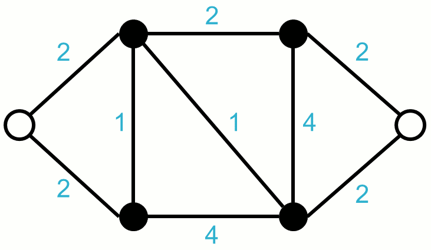
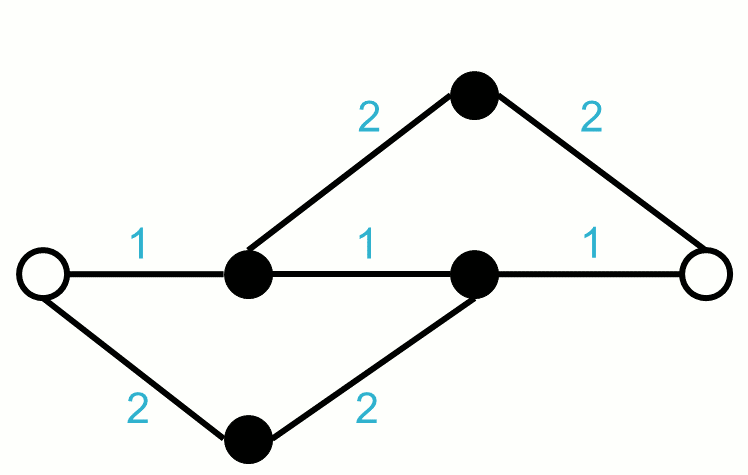

.. _pce_bhandari:

Bhandari PCE Module
===================

This module is one of the fundamental pathfinding elements of the PCE, used to compute the least-cost pair of edge-disjoint paths through a network topology. Such a technique is useful for :ref:`surv_pce_services`. Bhandari's Algorithm_ differs from other heuristics which aim to minimize the cost of the primary path at the cost of a more expensive secondary path. Consider the example below:

Simple Path Protection
----------------------

The animation below illustrates how a pair of link-disjoint paths may be found on a network topology in a simple manner.  The steps are very straightforward:

1. Compute the shortest route on the topology (using Dijsktra_'s algorithm or the Bellman-Ford_ algorithm) as the primary path.
2. Remove all links along the computed primary path from the topology.
3. Compute the shortest route on the updated topology, which will serve as the backup path.

    *Simple path protection: Optimize the primary path, and then compute a link-disjoint backup.*

Let's repeat the process for the different topology shown below. It can be observed that removing the links from the primary path actually prevents a backup from being computed. This results in a false-negative indicating that no pair of disjoint paths could be found.  Bhandari's algorithm prevents this false-negative.

.. figure:: ../../.static/protection_fail.gif
    :scale: 75%
    :alt: Traiditional Path Protection Failure
    :align: center

    *Simple path protection: After computing the primary path, not backup path can exist.*

Bhandari's Algorithm
--------------------

We revisit the second example above, this time using Bhandari's algorithm to show how it computes the least-cost pair of paths. The steps are as follows:

1. Compute the shortest route on the topology (using Dijsktra_'s algorithm or the Bellman-Ford_ algorithm), but do *not* treat this as the primary path.
2. Set the costs of all links found along this initial path to negative weights.
3. Set the direction of all links found along this initial path to the opposite of the route's flow.
4. Now compute the shortest route on the updated topology (using the Bellman-Ford algorithm which supports negatively-weighted edges).
5. Remove any overlapping edges shared by the first path and the second path. The remaining resources represent the least-cost pair of routes from the source to the destination.

    *Bhandari path protection: Returns the least-cost pair solution.*

.. _Algorithm: https://en.wikipedia.org/wiki/Edge_disjoint_shortest_pair_algorithm
.. _Dijsktra: https://en.wikipedia.org/wiki/Dijkstra's_algorithm
.. _Bellman-Ford: https://en.wikipedia.org/wiki/Bellman%E2%80%93Ford_algorithm

Module Details
--------------
**Calls:**

- :ref:`pce_bellman_ford`

**Called By:** 

- :ref:`pce_survivability`
- :ref:`virtual_topo_surv`

**API Specification:**

- :java:ref:`BhandariPCE`
