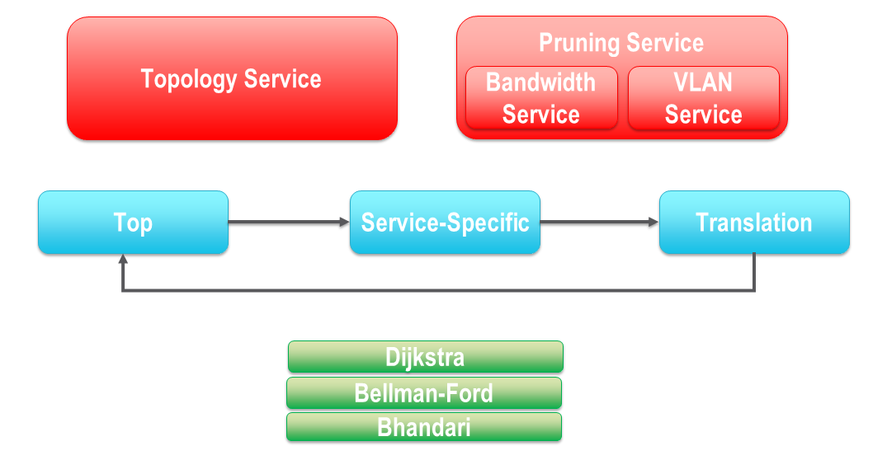

.. _pce_doc:

Path Computation Engine (PCE)
=============================

The PCE subsystem provides all of the logic involved with identifying constrained routing solutions. It is, more or less, the engine upon which OSCARS 1.0 is built. The PCE architecture is simply designed, with components grouped into three rough, interdependent categories, shown in the figure below, and described as follows.

.. figure:: ../.static/pce_arch_1.png
    :scale: 50%
    :alt: PCE Architecture
    :align: center

    *High-level PCE component categories.*

Request & Topology Services
---------------------------

The PCE subsystem heavily relies upon the :ref:`service_topology` and :ref:`service_pruning` modules. This collection of services is responsible for evaluating the user inputs, and pruning the topology as necessary depending on which resources are (or are not) available during the reservation’s prescribed lifetime. Depending on what parameters are associated with the :ref:`requestspec`, when it is passed into the PCE, the topology will be pruned differently.  The services in this category can be considered support modules to the PCE business logic modules.

Request-Specific PCE Logic Workflow
-----------------------------------

The modules in this category comprise the “brain” of the PCE. As of OSCARS 1.0, the progression through the PCE is dynamic. Submodules are engaged depending solely on the user’s input, as specified by the :ref:`plumbing` and do not require any configuration alterations to the system. Details of the :ref:`pce_workflow` and :ref:`pce_structure` are discussed later in this document.

.. _pathfinding_algorithms:

Pathfinding Algorithms
----------------------

These modules contain standard graph-theory algorithms for identifying routes among nodes through the network. The algorithms take in a topology and the user-requested parameters, and identify the best path, or set of paths to satisfy the demand. Algorithms include: Dijkstra, Bellman-Ford, Bhandari. These modules can be considered support modules for the PCE business logic modules. A number of :ref:`advanced_service` have been integrated into the PCE to provide intelligent and flexible pathfinding solutions. Those services harness theses standard graph-theory algorithms as underlying routing implementation.

    *Finer-grain PCE component modules.*

.. _pce_workflow:

PCE Workflow
============

The OSCARS 1.0 PCE is modular in design, and supports constraint-driven adaptive routing. This means that the current state of the network is taken into account during scheduling in order to prevent conflicts, as well as to identify the best routing solution for each circuit on-demand. The procedure for reserving a reservation is as follows, beginning at the :ref:`pce_top`:

**1.   Parse Request Specification.**
	a. Identify what the user has requested (Start-time, End-time,bandwidth, etc. as specified in the :ref:`requestspec`)
	b. Forward input parameters to the appropriate PCE service-specific module.

**2.   Obtain current network state information.**
	a. Query the :ref:`service_topology` for devices/ports/links, including connectivity and resource-availability details.
	b. Identify types of nodes (Ethernet Switch / MPLS Router / Port).

**3.   Prune the network.**
	a. Form a relationship between network resources and user request.
	b. Invoke the :ref:`service_pruning` to temporarily remove network elements that violate the Request Specification.
		i. Elements with *Insufficient bandwidth*.
		ii. Elements with *Insufficient VLAN availability*.

**4.   Pathfinding.**
	a. Employ one of the appropriate :ref:`pathfinding_algorithms` to compute the shortest (least-cost) route(s) through the pruned network. The result is the least-cost constrained route.
		i. Solution approaches may vary based on Request Specification and Topology state.

**5.   Reservation.**
	a. If Pathfinding is successful, save the selected network resources (route information, selected VLAN, schedule, etc.) into the circuit's :ref:`resvspec`. Otherwise, fail gracefully.
	b. Save the circuit details in the Reservation Database. 

**6.   Configure the networks.**
	a. Forward the reservation details to the :ref:`pss` for network configuration.

When the PCE is engaged, the user is offered one guarantee: If there is a route through the network that can satisfy the requested paramters, OSCARS will find it.

.. _basic_pce_service:

Basic PCE Service
-----------------

The animation below illustrates the fundamental behavior of the PCE in action. This example offers a glimpse at a small network with only one path available to the circuit requested from *port A* to *port Z* (colors and shapes are described in the :ref:`topologyref`). In the simplest of use-cases, the circuit established is bidirectional and symetric, meaning that the same path is selected in the reverse direction (*Z-A*), and the reserved bandwidth is identical in both directions. For the sake of clarity we assume that the requested bandwidth is smaller than the capacity on each link along the given path. Therefore, no topology elements warrant pruning.

.. figure:: ../.static/pce_basic.gif
    :scale: 65%
    :alt: Basic PCE
    :align: center

    *Basic PCE behavior: End-to-end circuit is established in a bidirectional and symmetric fashion.*

As an alternative, consider the next figure which depicts a circuit reservation request with a bandwidth requirement of 100 Mbps between *port A* and *port Z*. As shown however, the link capcity between *device M* and *device N* is less than sufficient, and can only support a maximum of 50 Mbps (this coule be due to network design decisions, or could be the result of other unrelated circuit reservation which have previously reserved the majority of the link's available bandwidth resources). This example illustrates how links are pruned from the network. Since the topology is so small, there is no alternative path for the circuit. When the PCE fails to find a working path solution, the request itself fails, and no Reservation Specification is added to the circuit. The circuit is added to the Reservation Database in the failed state.

.. figure:: ../.static/pce_fail.gif
    :scale: 65%
    :alt: Basic PCE Failure
    :align: center

    *Basic PCE behavior: If a suitable path cannot be computed, the circuit fails.*

The next animation shows a larger network with alternative path solutions throughout the network from *port A* to *port Z*. OSCARS 1.0 supports shortest-path routing solutions. Since the path length through the northern hemisphere of the shown network (M-N-O) is shorter in length than the southern route (M-P-Q-O), the northern path is preferred. OSCARS aims to always provide the shortest constrained-path in this manner. The :ref:`pathfinding_algorithms` described briefly above provide the underlying logic for this path computation.

.. figure:: ../.static/pce_altroute.gif
    :scale: 65%
    :alt: Basic PCE Routing
    :align: center

    *Basic PCE behavior: The shortest path is preferred by the PCE.*

It's important to note that the PCE identifies the shortest *constrained-path*, where the constraints are resource availability. The PCE employs an adaptive routing solution service rather than precomputing circuit routes. For example, consider the slight change to the network shown below where once again the link *(M,N)* cannot support the requested bandwidth constraint. In this scenario, that link will be pruned from the network. Fortunately however, there remains a connected alternative route *(M-P-Q-O)*, which is selected and assigned to the circuit.  As such, if a connected path exists which can support the requested constraints, OSCARS will compute it (even if it  take an out-of-the-way set of links). OSCARS prioritizes working solutions over cost, but will reduce cost overhead as much as possible if a solution can be found.

.. figure:: ../.static/pce_fullbehavior.gif
    :scale: 65%
    :alt: Basic PCE Full
    :align: center

    *Basic PCE behavior: The shortest constrained-path is computed by the PCE.*

OSCARS 1.0 incorporates a modular PCE, such that the basic pathfinding solutions shown here do not exhibit the entire potential of the system. Taking its influence from emerging communication trends from industry and academia alike, OSCARS 1.0 also includes a robust catalog of :ref:`advanced_service`. Each of these services provides additional flexibility and control over how the PCE identifies solutions.

Service Details
^^^^^^^^^^^^^^^

**Can be combined with:**

- :ref:`asymm_pce_service`
- :ref:`multipoint_pce_service`

**Relevant PCE Module(s)**

- :ref:`pce_palindrome`

.. _pce_structure:

PCE Structure
=============

.. figure:: ../.static/pce_arch_2.png
    :scale: 50%
    :alt: PCE Wokflow
    :align: center

    *PCE business logic workflow.*

The figure above shows the logic flow through the PCE. The :ref:`requestspec` enters the :ref:`pce_top`, which serves as the Reservation Workflow Control mechanism and decomposes the request into its :ref:`plumbing` and determines how to process each pipe. Note that pipes are specified independently, meaning that the Top PCE may prescribe different flows for a single circuit request. Each requested pipe will then be fed through one or more service-specific PCE submodules in order to perform the desired constrained pathfinding. These service-specific submodules each provide unique logic to identify routing solutions. These submodules are integrated to provide the set of :ref:`advanced_service` new to OSCARS 1.0. For example, assume that a user wants to incorporate a survivable backup path to be computed upon submission of a circuit request. There exists a PCE submodule designed for accomplishing exactly this task. Alternatively, consider a scenario in which the user wishes to prescribe a specific route, often known as an *Explicit Route Object (ERO)* to a circuit. The OSCARS PCE provides a submodule for supporting such an action. The desired services are triggered during request specification, and the Top PCE will determine which of the appropriate PCE submodules to engage for supporting them. The figure below gives an expanded view of the PCE logic workflow. Each of the service-specific PCE submodules (which may cooperate with one another in some cases) will return the selected path elements describing the routing solution. The selected elements are then passed to the :ref:`pce_translation` where the route is adapted into the reserved plumbing architecture which comprises the :ref:`resvspec`. A significant portion of this process is that of :ref:`vlan_translation`. The reservation details are added to the circuit, which is returned back to the Top PCE, which in turn gives back to the caller the updated circuit.

.. figure:: ../.static/pce_arch_3.png
    :scale: 50%
    :alt: PCE Expanded Wokflow
    :align: center

    *Expanded PCE business logic workflow.*

PCE Submodules
--------------

General PCE Submodules
^^^^^^^^^^^^^^^^^^^^^^

.. toctree::
   :maxdepth: 1

   pce/pce_top_doc
   pce/pce_translation_doc
   pce/pce_layer3_doc

Service-Specific PCE Submodules
^^^^^^^^^^^^^^^^^^^^^^^^^^^^^^^

.. toctree::
   :maxdepth: 1

   pce/pce_palindrome_doc
   pce/pce_nonpalindrome_doc
   pce/pce_survivability_doc
   pce/pce_ero_doc

Pathfinding PCE Submodules
^^^^^^^^^^^^^^^^^^^^^^^^^^

.. toctree::
   :maxdepth: 1

   pce/pce_dijkstra_doc
   pce/pce_bellman_ford_doc
   pce/pce_bhandari_doc

Request and Topology Service Submodules
^^^^^^^^^^^^^^^^^^^^^^^^^^^^^^^^^^^^^^^

.. toctree::
   :maxdepth: 1

   service/service_topology_doc
   service/service_pruning_doc
   service/service_bandwidth_doc
   service/service_vlan_doc

BandwidthService
Calls: ReservedBandwidthRepository, UrnRepository
Called By: TopPCE, PruningService, TranslationPCE, BandwidthAvailabilityService
Description: Provides methods that handle retrieving reserved bandwidth objects from the repository, mapping reserved/available/requested bandwidth to network elements, and determining if requested bandwidth can be supported on a topology.

PruningService
Calls: UrnRepository, VlanService, BandwidthService, TopoService
Called By: TopPCE, PalindromicalPCE, NonPalindromicalPCE, SurvivabilityPCE, EroPCE, ServiceLayerTopology, SurvivableServiceLayerTopology
Description: Removes network links from a topology given a combination of requested bandwidth/VLAN IDs and reserved bandwidth/VLAN IDs.

