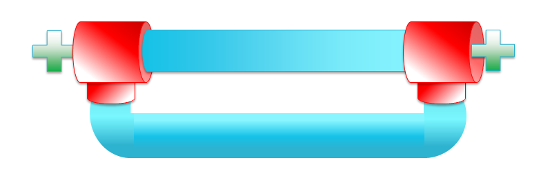
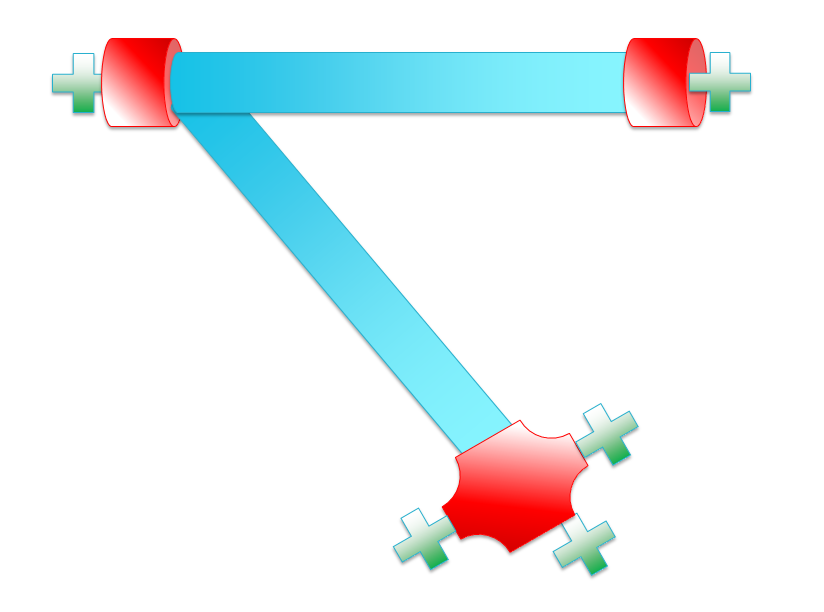

.. _plumbing:

Plumbing Specification
======================

OSCARS 1.0 has introduced a design which enables users to logically represent the circuit flow(s) that are scheduled. In addition to specifying the essential parameters as inputs, such as the start- and end-times, required bandwidth, etc., circuits can be represented visually and described easily using terminology from the real world.  Consider the plumbing works of a home or office building as shown in the figure below. The three main components are:

- **Pipes**, which carry the water throughout the system.
- **Junctions**, which are the major hubs at which the water may be diverted or change course. These can be visualized as the T-junctions which connect three or more pipes together. 
- **Fixtures**, which represent the ingress and egress points to the plumbing. These are items such as taps/faucets, sinks, bathtubs, etc. For the sake of simplicity, we will impose a rule that all Fixtures are attached directly to a Junction.

.. figure:: ../.static/pipehome.png
    :scale: 50%
    :alt: Plumbing in the home
    :align: center

    *Plumbing components in the home: pipes, junctions, fixtures.*

OSCARS applies the above analogy to each circuit request and reservation; obviously replacing the water transferred through the system with network traffic. Here, the fixtures are simply the ingress/egress ports where the data enters/exits the network. The junctions represent the network devices (Ethernet switches and MPLS routers). Note that the ingress/egress ports are found on these devices. Lastly, the pipes will connect the junctions. OSCARS passes the user request into the :ref:`pce_doc` in the form of a set of Requested Pipes and Requested “Simple” Junctions (which represent a request to establish a circuit from one port on a device to another port on the same device). Note: No fewer than two fixtures may be specified as part of a circuit request.

.. figure:: ../.static/pipeintro.png
    :scale: 50%
    :alt: Plumbing overview
    :align: center

    *Overview of OSCARS circuit plumbing representation.*

Using these sets of requested pipes and junctions, pathfinding is performed by PCE modules based on the user's :ref:`requestspec`, and then the solution paths are translated back into Reserved Pipes, Reserved Junctions, and Reserved Fixtures. An example of the distinction between Requested plumbing, the physical path, and Reserved plumbing is shown in the figure above. This process (performed by the :ref:`pce_translation`) takes a physical path, and converts it into a series of pipes (or just singular junctions, for any requested “simple” junctions) in the following manner: 

- For each pair of adjacent Ethernet switches, a reserved pipe is constructed, with the ports connecting them contained within the pipe, and with the two switches represented as junctions.
- For each Ethernet switch -- MPLS router pair, a reserved pipe is constructed in the same fashion.
- For each segment of two or more MPLS routers “in a row”, one reserved MPLS pipe is constructed, where the first MPLS router and the last MPLS router in the segment act as junctions, while any intermediate ports or other MPLS routers are contained within the pipe. 

Advanced Plumbing
=================

The advantage to this logical plumbing setup is that it enables a user to very easily visualize the requested circuit from a logical perspective. Furthermore, if the user wishes to take advantage of the numerous new service enhancements offered by the PCE, or provide details for multiple circuits simultaneously, they can do so simply be prescribing pipes correctly. Each circuit request may consist of multiple plumbing units.  For example, consider the following figure which specifies a pair pipes as part of the same circuit request. OSCARS will handle both of those pipes together as a single submission and produce the following pair of circuits.

.. figure:: ../.static/pipe_pair.png
    :scale: 50%
    :alt: Advanced plumbing pair
    :align: center

    *Advanced plumbing: Multiple pipes between more than two junctions.*

Multi-Pipe Plumbing
-------------------
Consider a case where two paths are required between the end-points of a circuit. This may include scenarios such as multipath routing in which the user wishes to oversubscribe the bandwidth capacity of a connection for parallel transfers. Specifically, two circuits (which may or may not consist of the same physical routes through the network topology) are desired. Another use-case is survivable networking. The user may expect two (or more) link-disjoint paths through the network in case on circuit fails due to a physical malfunction on the network.  The following diagram depicts the appropriate Request Specification. A user very simply needs to specify two distinct pipes, both with the same junctions and fixtures, and OSCARS handled the rest.

    *Advanced plumbing: Multi-pipe circuit request between the same junction/fixture pairs.*

Multi-Directional Plumbing
--------------------------
Many networking applications call for replicated backup of mission-critical datasets or distribution of information for collaborative analysis and study. OSCARS 1.0 supports these use-cases easily, enabling the user to specify such a multi-directional or multicast communication setup effortlessly through the appropriate plumbing description. Consider the figure below. Two unique pipes are established between the set of three junctions. This specification ensures that the top-left resource is able to share and distribute data to both of its peers. As a bonus, the junction at the bottom of the figure has three fixtures specified, indicating that data will be distributed onto three adjacent LANs (which may be entirely separate network domains).

    *Advanced plumbing: Multi-directional circuit request between a set of junctions.*

User's Choice Plumbing
----------------------
Given this robust plumbing infrastructure the possibilities are truly endless when it comes to specifying a logical request. As long as at least two fixtures are included in the specification (and of course assuming that the network can support the desired bandwidth and VLAN resources) any circuit set is feasible. Consider the pair of figures below for an idea of the possibilities. 

.. figure:: ../.static/pipe_advanced_3.png
    :scale: 50%
    :alt: Advanced plumbing 3
    :align: center

    *Advanced plumbing: Flexible to application's needs.*

OSCARS 1.0 is designed to seamlessly adapt to a user's changing service requirements. More importantly, OSCARS 1.0 has been designed with a focus on introducing a novel service suite never before offered on a such a large-scale or commercial system. By focusing on the cutting-edge at inception, new and emerging communication paradigms from academia and industry alike will be easily adopted in OSCARS! 

The :ref:`pce_doc` is responsible for computing the routes necessary to construct the circuit reservation. If the user specifies multiple pipes with different parameters or service requirements, each pipe is handled independently. For example, a request consisting of two unique pipes, where one pipe specifies *Service A*, and the other specifies *Service B*, both pipes will be satisfied without interference from the other's service.

