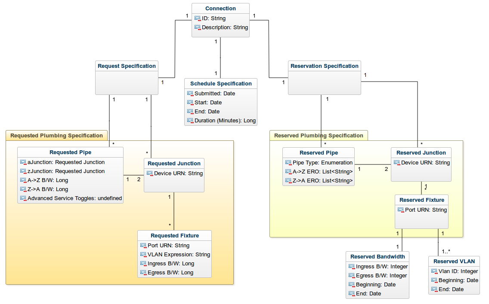

.. _virtualcircuit:

Virtual Circuits
================

OSCARS 1.0 serves as the automated resource allocation engine to dynamically establish virtual circuits on ESnet. A virtual circuit (commonly referred to more simply as circuit throughout this documentation) 
provides a dedicated portion of available bandwidth according to the user's desired schedule, service, and path requirements. The circuits represent logical connections with guaranteed bandwidth and service on the network, despite the fact that traffic is carried as IP-over-Optical. 

This documentation details the major components of an OSCARS circuit, including the requested and reserved attributes, and the logical organization of these attributes within the software's code.  The figure below gives a high-level view of key OSCARS circuit components.

    *High-level depiction of OSCARS virtual circuit components.*

Circuit Architecture
--------------------
.. toctree::
   :titlesonly:
   :includehidden:

   circuit/requestspec_doc
   circuit/schedspec_doc
   circuit/resvspec_doc
   circuit/plumbing_doc
